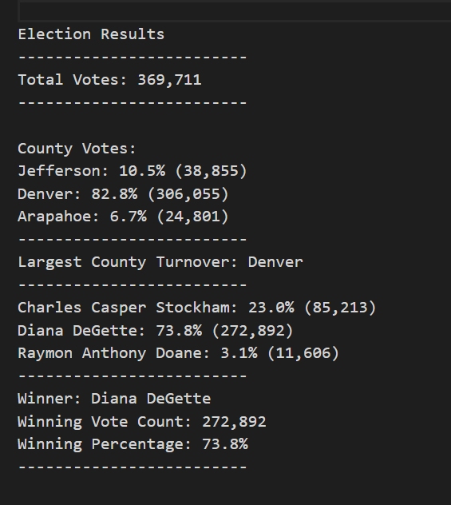
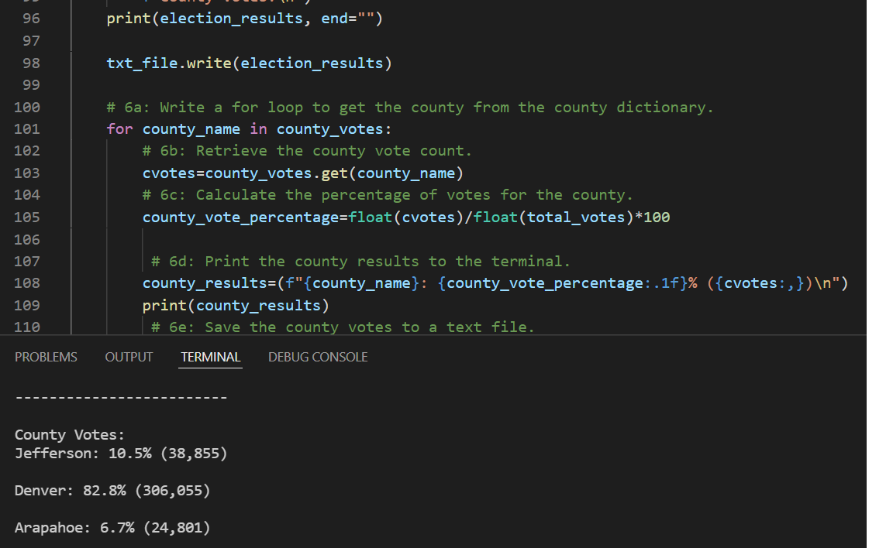
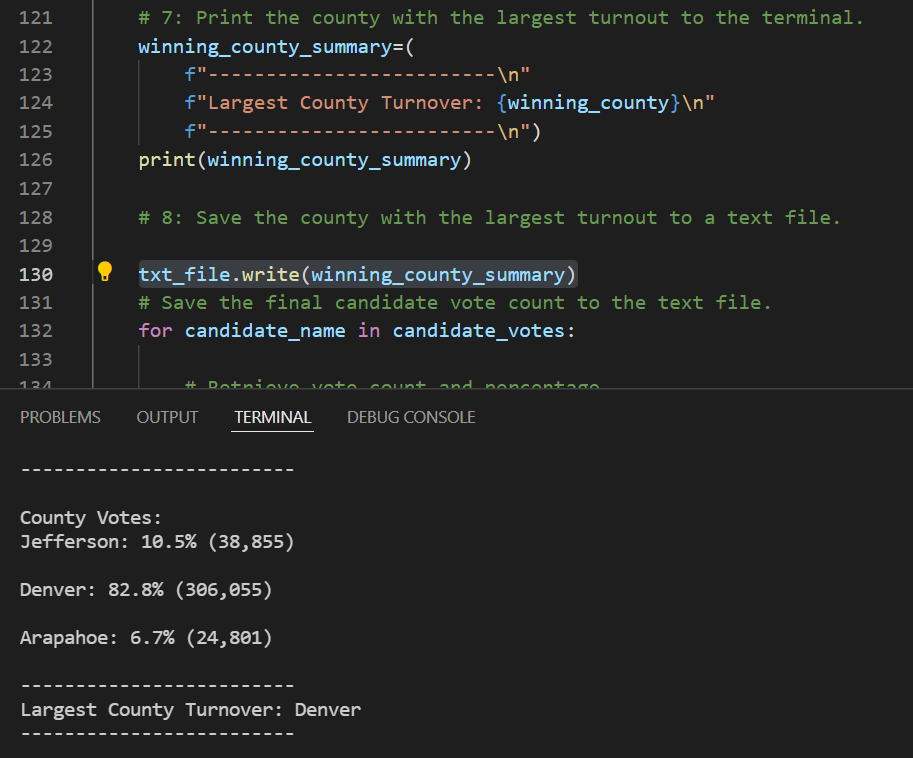

# Election_Analysis

### Project Overview
This project has been undertaken on behalf of the Colorado Board of Elections to complete the election audit of a recent local congressional election. For completing this project, we need to calculate
1. The total number of votes cast in the congressional election
2. Breakdown of the number of votes and the percentage of total votes for each county in the precinct
3. The county that received the largest number of votes
4. Breakdown of the number of votes and the percentage of the total votes each candidate received
5. Which candidate won the election, their vote count and the percentage of the total votes

### Resources
- Data Source: election_results.csv
- Software: Python 3.10 , Visual Studio Code,1.65.2

### Summary
The analysis of the election show that:
- **369,711** votes were case in total
- There were three counties in the precinct
  - Arapahoe
  - Denver
  - Jefferson
- There were three candidates who were voted for
  - Charles Casper Stockham
  - Diana DeGette
  - Raymon Anthony Doane
- The total number of votes received by each county were
  - **Jefferson county** received 10.5% of the total votes with 38,855 votes
  - **Denver county** received 82.8% of the total votes with 306,055 votes
  - **Arapahoe county** received 6.7% of the total votes with 24,801 votes
- The total number of votes received by each candidate were
  - **Charles Casper Stockham** received 23% votes with 85,213 number of votes
  - **Diana DeGette** received 73.8% votes with 272,892 number of votes
  - **Raymon Anthony Doane** received 3.1% votes with 11,606 number of votes
- The **winning county** that received the highest number of votes was **Denver**.
- The **winning candidate** of the election was **Diana DeGette** with 272,892 votes(73.8%) 



### Step-By-Step Codes for 
#### 1: Create a county list and county votes dictionary.
```
county_options= []
county_votes= {}

```
#### 2: Track the largest county and county voter turnout.
```
winning_county=""
winning_votecount=0
winning_votepercentage=0

```
#### 3: Extract the county name from each row.
```
county_name= row[1]

```
#### 4a: Write an if statement that checks that the county does not match any existing county in the county list.
```
if county_name not in county_options:

```
#### 4b: Add the existing county to the list of counties
```
    county_options.append(county_name)
```
#### 4c: Begin tracking the county's vote count.
```
    county_votes[county_name]=0
    
```
#### 5: Add a vote to that county's vote count.
```
county_votes[county_name] +=1

```
#### 6a: Write a for loop to get the county from the county dictionary.
```
for county_name in county_votes:

```
#### 6b: Retrieve the county vote count.
```
cvotes=county_votes.get(county_name)

```
#### 6c: Calculate the percentage of votes for the county.
```
county_vote_percentage=float(cvotes)/float(total_votes)*100

```
#### 6d: Print the county results to the terminal.
```
county_results=(f"{county_name}: {county_vote_percentage:.1f}% ({cvotes:,})\n")
print(county_results) 

```


#### 6e: Save the county votes to a text file. 
```
txt_file.write(county_results)

```
#### 6f: Write an if statement to determine the winning county and get its vote count.
```
if (cvotes>winning_votecount) and (county_vote_percentage>winning_votepercentage):
    winning_votecount=cvotes
    winning_county=county_name
    winning_votepercentage=county_vote_percentage
    
```
#### 7: Print the county with the largest turnout to the terminal.
```
winning_county_summary=(
    f"-------------------------\n"
    f"Largest County Turnover: {winning_county}\n"
    f"-------------------------\n")
print(winning_county_summary)

```

#### 8: Save the county with the largest turnout to a text file.
```
txt_file.write(winning_county_summary)

```
### Election Audit Summary
This script can be extremely useful for the election commission as it can be modified and used for calculating election results quickly in other states outside Colorado. We can modify the reader file so that the script can read any csv files and also easily modify the county and candidate details for any election.

